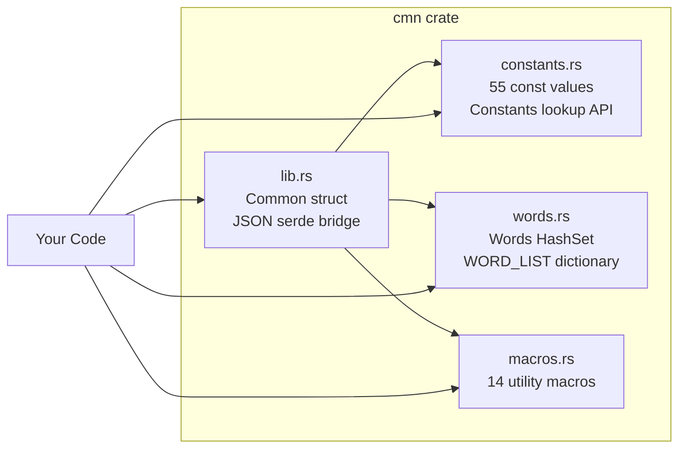

<p align="center">
  
</p>

<h1 align="center">Common (CMN)</h1>

<p align="center">
  <strong>55 mathematical and cryptographic constants for Rust. Zero runtime cost. One dependency.</strong>
</p>

<p align="center">
  <a href="https://github.com/sebastienrousseau/cmn/actions"></a>
  <a href="https://crates.io/crates/cmn"></a>
  <a href="https://docs.rs/cmn"></a>
  <a href="https://codecov.io/gh/sebastienrousseau/cmn"></a>
  <a href="https://lib.rs/crates/cmn"></a>
</p>

---

## What is CMN?

CMN gives you accurate, well-documented mathematical and physical constants as compile-time `const` values in Rust. Every constant resolves at compile time with zero runtime allocation.

**One line to install. Zero configuration. 198 tests. 100% code coverage.**

```bash
cargo add cmn
```

---

## Why CMN?

| Need | Without CMN | With CMN |
|:---|:---|:---|
| PI, E, TAU | Hand-copy from `std::f64::consts` or Wikipedia | `use cmn::constants::PI;` |
| Physical constants (Avogadro, Planck, Boltzmann) | No stdlib equivalent; copy-paste from NIST | Pre-validated, sourced from CODATA |
| Typed constant lookup at runtime | Build your own HashMap | `constants.get_value("PI")` returns `ConstantValue::Float` |
| Utility macros (min, max, range-check) | Write boilerplate or pull in a macro crate | `cmn_max!(3, 7, 2)` — done |
| Word list for passphrase generation | Find a dictionary crate or embed your own | `Words::default()` — curated, deduplicated, sorted |

### How CMN compares to other constants crates

| | `cmn` | `physical_constants` | `natural_constants` | `std::f64::consts` |
|:---|:---:|:---:|:---:|:---:|
| **Constants** | 55 | 354 | 370+ | 11 |
| **Runtime typed lookup** | `ConstantValue` enum | -- | -- | -- |
| **Utility macros** | 14 | -- | -- | -- |
| **Word list** | Built-in | -- | -- | -- |
| **License** | MIT / Apache-2.0 | GPL-3.0 | MIT | stdlib |
| **Test coverage** | 100% (198 tests) | Unknown | Unknown | N/A |
| **Documentation** | 100% | 100% | 29% | stdlib |
| **MSRV** | 1.72 | Unspecified | Unspecified | N/A |

`physical_constants` has the most values but is **GPL-3.0** — incompatible with MIT/Apache projects. `natural_constants` spans the most disciplines but is 29% documented and stale since 2022. CMN is the only crate that combines constants, typed runtime lookup, utility macros, and a word list under a permissive license with 100% test coverage.

---

## Install

Add to `Cargo.toml`:

```toml
[dependencies]
cmn = "0.0.5"
```

Requires [Rust](https://rustup.rs/) 1.72+. Works on macOS, Linux, and Windows.

---

## Quick Start

### Constants (compile-time)

```rust
use cmn::constants::{PI, TAU, EULER, SQRT2};

fn main() {
    println!("PI    = {PI}");
    println!("TAU   = {TAU}");
    println!("e     = {EULER}");
    println!("sqrt2 = {SQRT2}");
}
```

### Constants (runtime lookup)

```rust
use cmn::constants::{Constants, ConstantValue};

let constants = Constants::new();
if let Some(ConstantValue::Float(pi)) = constants.get_value("PI") {
    println!("PI = {pi}");
}
```

### Macros

```rust
use cmn::{cmn_max, cmn_min, cmn_in_range, cmn_vec};

let max = cmn_max!(3, 7, 2);       // 7
let min = cmn_min!(3, 7, 2);       // 2
let ok  = cmn_in_range!(5, 0, 10); // true
let v   = cmn_vec!(1, 2, 3);       // Vec<i32>
```

### Word List

```rust
use cmn::Words;

let words = Words::default();
println!("{} words loaded", words.count());
println!("First: {}", words.words_list()[0]); // "aboard"
```

### Datetime

```rust
use cmn::datetime::DateTime;

let dt = DateTime::parse("2026-04-05T14:30:00Z").unwrap();
assert_eq!(dt.year(), 2026);
assert_eq!(dt.to_iso8601(), "2026-04-05T14:30:00Z");

// Duration between two datetimes
let dt2 = DateTime::parse("2026-04-05T16:30:00Z").unwrap();
let dur = dt2.duration_since(&dt);
assert_eq!(dur.whole_hours(), 2);

// Relative time formatting
let rel = dt.relative_to(&dt2);
assert_eq!(rel, "2 hours ago");
```

---

## Available Constants

### Mathematical — Core

| Constant | Symbol | Value |
|:---|:---|:---|
| `PI` | `pi` | 3.14159265358979... |
| `TAU` | `tau = 2pi` | 6.28318530717958... |
| `EULER` | `e` | 2.71828182845904... |
| `PHI` | `phi = (1+sqrt5)/2` | 1.61803398874989... |
| `GAMMA` | `gamma` (Euler-Mascheroni) | 0.57721566490153... |
| `SQRT2`, `SQRT3`, `SQRT5` | Square roots | Exact `f64` values |
| `APERY` | `zeta(3)` | 1.20205690315959... |
| `CATALAN` | `C` | 0.91596559417721... |
| `KHINCHIN` | `K` | 2.68545200106530... |
| `GLAISHER_KINKELIN` | `A` | 1.28242712910062... |
| `SILVER_RATIO` | `delta_s = 1+sqrt2` | 2.41421356237309... |

### Mathematical — Logarithmic & Pi Fractions

| Constant | Symbol | Value |
|:---|:---|:---|
| `LN_2` | `ln(2)` | 0.69314718055994... |
| `LN_10` | `ln(10)` | 2.30258509299404... |
| `LOG2_E` | `log2(e)` | 1.44269504088896... |
| `LOG10_E` | `log10(e)` | 0.43429448190325... |
| `FRAC_1_SQRT_2` | `1/sqrt(2)` | 0.70710678118654... |
| `FRAC_1_PI` | `1/pi` | 0.31830988618379... |
| `FRAC_2_PI` | `2/pi` | 0.63661977236758... |
| `FRAC_2_SQRT_PI` | `2/sqrt(pi)` | 1.12837916709551... |
| `FRAC_PI_2` | `pi/2` | 1.57079632679489... |
| `FRAC_PI_3` | `pi/3` | 1.04719755119659... |
| `FRAC_PI_4` | `pi/4` | 0.78539816339744... |
| `FRAC_PI_6` | `pi/6` | 0.52359877559829... |
| `FRAC_PI_8` | `pi/8` | 0.39269908169872... |

### Physical — Fundamental

| Constant | Symbol | Value | Unit |
|:---|:---|:---|:---|
| `SPEED_OF_LIGHT` | `c` | 299,792,458 | m/s |
| `PLANCK` | `h` | 6.62607015e-34 | J s |
| `PLANCK_REDUCED` | `h-bar` | h / 2pi | J s |
| `ELEMENTARY_CHARGE` | `e` | 1.602176634e-19 | C |
| `BOLTZMANN` | `k_B` | 1.380649e-23 | J/K |
| `AVOGADRO` | `N_A` | 6.02214076e23 | 1/mol |
| `GAS_CONSTANT` | `R = k_B * N_A` | 8.314462618 | J/(mol K) |
| `FARADAY` | `F = N_A * e` | 96,485.33212 | C/mol |
| `GRAVITATIONAL_CONSTANT` | `G` | 6.67430e-11 | m^3/(kg s^2) |
| `FINE_STRUCTURE` | `alpha` | 7.2973525693e-3 | dimensionless |

### Physical — Electromagnetic & Vacuum

| Constant | Symbol | Value | Unit |
|:---|:---|:---|:---|
| `COULOMB` | `k_e` | 8.9875517923e9 | N m^2/C^2 |
| `VACUUM_PERMEABILITY` | `mu_0` | 1.25663706212e-6 | N/A^2 |
| `VACUUM_PERMITTIVITY` | `eps_0` | 8.8541878128e-12 | F/m |
| `MAGNETIC_FLUX_QUANTUM` | `Phi_0 = h/(2e)` | 2.067833848e-15 | Wb |
| `CONDUCTANCE_QUANTUM` | `G_0 = 2e^2/h` | 7.748091729e-5 | S |

### Physical — Particles & Thermodynamics

| Constant | Symbol | Value | Unit |
|:---|:---|:---|:---|
| `ELECTRON_MASS` | `m_e` | 9.1093837015e-31 | kg |
| `PROTON_MASS` | `m_p` | 1.67262192369e-27 | kg |
| `NEUTRON_MASS` | `m_n` | 1.67492749804e-27 | kg |
| `ATOMIC_MASS_UNIT` | `u` | 1.66053906660e-27 | kg |
| `BOHR_RADIUS` | `a_0` | 5.29177210903e-11 | m |
| `RYDBERG` | `R_inf` | 10,973,731.568160 | 1/m |
| `STEFAN_BOLTZMANN` | `sigma` | 5.670374419e-8 | W/(m^2 K^4) |
| `WIEN_DISPLACEMENT` | `b` | 2.897771955e-3 | m K |
| `STANDARD_GRAVITY` | `g` | 9.80665 | m/s^2 |
| `STANDARD_ATMOSPHERE` | `atm` | 101,325 | Pa |

### Cryptographic & Utility

| Constant | Type | Value |
|:---|:---|:---|
| `HASH_ALGORITHM` | `&str` | `"Blake3"` |
| `HASH_COST` | `u32` | `8` |
| `HASH_LENGTH` | `usize` | `32` |
| `SPECIAL_CHARS` | `&[char]` | 29 symbols (`!@#$%^&*`...) |

Full API reference: [docs.rs/cmn](https://docs.rs/cmn)

---

## Architecture



| Module | What it does | When to use it |
|:---|:---|:---|
| [`constants`](https://docs.rs/cmn/latest/cmn/constants/) | 55 compile-time `const` values + `Constants` runtime API + `ConstantValue` enum | You need a mathematical or physical constant |
| [`words`](https://docs.rs/cmn/latest/cmn/words/) | `Words` struct backed by `HashSet<String>` with add/remove/contains + `WORD_LIST` | Passphrase generation, word games, text processing |
| [`macros`](https://docs.rs/cmn/latest/cmn/macros/) | 14 macros: `cmn_max!`, `cmn_min!`, `cmn_vec!`, `cmn_map!`, `cmn_in_range!`, etc. | Quick utilities without writing boilerplate |
| [`datetime`](https://docs.rs/cmn/latest/cmn/datetime/) | ISO 8601 parsing, relative formatting, duration math, timezone offsets | Timestamps, "3 hours ago", duration calculations — no external crate |
| [`Common`](https://docs.rs/cmn/latest/cmn/struct.Common.html) | JSON-backed bridge connecting constants + words via `serde` | Deserializing configuration that includes constants or words |

---

## FAQ

**How accurate are the constants?**
Mathematical constants use `std::f64::consts` where available (PI, E, TAU, SQRT2). Physical constants are sourced from CODATA 2018 recommended values. All values are validated by 198 tests including mathematical identity checks (e.g., `SQRT2^2 == 2`, `R == k_B * N_A`).

**Does CMN support `no_std`?**
Yes. Disable default features to get all 55 `const` values and 14 macros with zero dependencies:
```toml
cmn = { version = "0.0.5", default-features = false }
```
The `Constants` runtime API, `Words`, and `Common` structs require the `std` feature (enabled by default).

**Does CMN compile to WASM?**
Yes. `cargo build --target wasm32-unknown-unknown --no-default-features` compiles cleanly.

**What is the MSRV?**
Rust **1.72**. Tested on stable. No nightly features required.

**How does CMN compare to other Rust constants crates?**
`physical_constants` has 354 values but is **GPL-3.0** — incompatible with MIT/Apache projects. `natural_constants` covers more disciplines but is only 29% documented and unmaintained since 2022. `std::f64::consts` provides 11 math constants with no physical or cryptographic values. CMN is the only crate combining constants, typed runtime lookup, utility macros, and a word list under a permissive license with 100% test coverage. See the [comparison table](#how-cmn-compares-to-other-constants-crates) above.

---

## Development

### Prerequisites

| Platform | Install Rust |
|:---|:---|
| **macOS** | `curl --proto '=https' --tlsv1.2 -sSf https://sh.rustup.rs \| sh` |
| **Linux / WSL** | Same as above, plus `sudo apt-get install -y build-essential` |
| **Windows** | Download [rustup-init.exe](https://rustup.rs/) and install the MSVC toolchain |

### Build, Test, Verify

```bash
git clone https://github.com/sebastienrousseau/cmn.git
cd cmn
cargo build        # Compile
cargo test         # 198 tests, 100% coverage
cargo clippy       # Zero warnings
cargo fmt --check  # Verify formatting
cargo doc --open   # Browse API docs locally
```

### Run Example

```bash
cargo run --example cmn
```

### Run Benchmarks

```bash
cargo bench
```

### Troubleshooting

| Symptom | Fix |
|:---|:---|
| `rustup: command not found` | Install Rust via [rustup.rs](https://rustup.rs/) |
| `error[E0658]: unstable library feature` | `rustup update stable` (MSRV is 1.72) |
| `linker 'cc' not found` (Linux/WSL) | `sudo apt-get install -y build-essential` |
| `cargo test` fails on fresh clone | Open an [issue](https://github.com/sebastienrousseau/cmn/issues) with `rustc --version` |

---

## Contributing

See [CONTRIBUTING.md](CONTRIBUTING.md) for signed-commit setup and PR guidelines.
See [CHANGELOG.md](CHANGELOG.md) for version history.

---

## License

Dual-licensed under [Apache 2.0](https://www.apache.org/licenses/LICENSE-2.0) or [MIT](https://opensource.org/licenses/MIT), at your option.

Built by [Sebastien Rousseau](https://sebastienrousseau.com).
