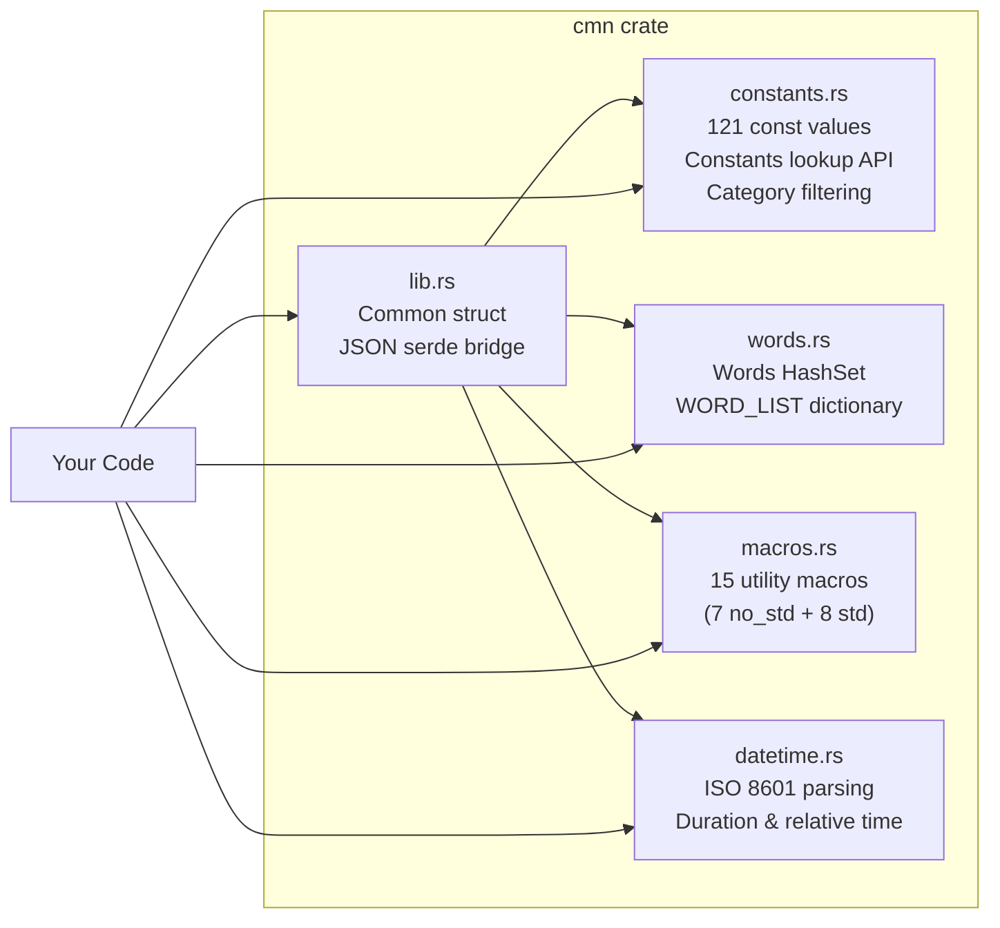

<p align="center">
  
</p>

<h1 align="center">Common (CMN)</h1>

<p align="center">
  <strong>121 mathematical and physical constants for Rust. Zero runtime cost. <code>no_std</code> compatible.</strong>
</p>

<p align="center">
  <a href="https://github.com/sebastienrousseau/cmn/actions"></a>
  <a href="https://crates.io/crates/cmn"></a>
  <a href="https://docs.rs/cmn"></a>
  <a href="https://codecov.io/gh/sebastienrousseau/cmn"></a>
  <a href="https://lib.rs/crates/cmn"></a>
</p>

---

## What is CMN?

CMN gives you accurate, well-documented mathematical and physical constants as compile-time `const` values in Rust. Every constant resolves at compile time with zero runtime allocation.

**One line to install. Zero configuration. 295 tests. 100% code coverage.**

```bash
cargo add cmn
```

---

## Why CMN?

| Need | Without CMN | With CMN |
|:---|:---|:---|
| PI, E, TAU | Hand-copy from `std::f64::consts` or Wikipedia | `use cmn::constants::PI;` |
| Physical constants (Avogadro, Planck, Boltzmann) | No stdlib equivalent; copy-paste from NIST | Pre-validated, sourced from CODATA 2018 |
| Boson masses (W, Z, Higgs) | Look up PDG tables manually | `W_BOSON_MASS_GEV`, `Z_BOSON_MASS_GEV`, `HIGGS_BOSON_MASS_GEV` |
| Typed constant lookup at runtime | Build your own HashMap | `constants.get_value("PI")` returns `ConstantValue::Float` |
| Utility macros (min, max, range-check) | Write boilerplate or pull in a macro crate | `cmn_max!(3, 7, 2)` — done |
| Datetime without chrono/time | Pull in a heavy dependency | `DateTime::parse("2026-04-05T14:30:00Z")` — zero deps |
| Word list for passphrase generation | Find a dictionary crate or embed your own | `Words::default()` — curated, deduplicated, sorted |

### How CMN compares to other constants crates

| | `cmn` | `physical_constants` | `natural_constants` | `std::f64::consts` |
|:---|:---:|:---:|:---:|:---:|
| **Constants** | 121 | 354 | 370+ | 11 |
| **Runtime typed lookup** | `ConstantValue` enum | -- | -- | -- |
| **Category filtering** | `Category` enum | -- | -- | -- |
| **`no_std` support** | Yes | No | No | Yes |
| **WASM support** | Yes | Unknown | Unknown | Yes |
| **Utility macros** | 15 (7 no_std + 8 std) | -- | -- | -- |
| **Datetime module** | Built-in | -- | -- | -- |
| **Word list** | Built-in | -- | -- | -- |
| **License** | MIT / Apache-2.0 | GPL-3.0 | MIT | stdlib |
| **Test coverage** | 100% (295 tests) | Unknown | Unknown | N/A |
| **Documentation** | 100% | 100% | 29% | stdlib |
| **MSRV** | 1.72 | Unspecified | Unspecified | N/A |

`physical_constants` has the most values but is **GPL-3.0** — incompatible with MIT/Apache projects. `natural_constants` spans the most disciplines but is 29% documented and stale since 2022. CMN is the only crate combining constants, typed runtime lookup, category filtering, `no_std`/WASM support, utility macros, a datetime module, and a word list under a permissive license with 100% test coverage.

---

## Install

Add to `Cargo.toml`:

```toml
[dependencies]
cmn = "0.0.6"
```

For `no_std` (constants + 7 macros only, zero dependencies):

```toml
cmn = { version = "0.0.6", default-features = false }
```

Requires [Rust](https://rustup.rs/) 1.72+. Works on macOS, Linux, Windows, and WASM.

---

## Quick Start

### Constants (compile-time)

```rust
use cmn::constants::{PI, TAU, EULER, SPEED_OF_LIGHT};

fn main() {
    println!("PI = {PI}");
    println!("TAU = {TAU}");
    println!("e = {EULER}");
    println!("c = {SPEED_OF_LIGHT} m/s");
}
```

### Constants (runtime lookup)

```rust
use cmn::constants::{Constants, ConstantValue};

let constants = Constants::new();
if let Some(ConstantValue::Float(pi)) = constants.get_value("PI") {
    println!("PI = {pi}");
}
```

### Category Filtering (no_std)

```rust
use cmn::constants::{CONSTANTS_TABLE, Category};

let physical: Vec<_> = CONSTANTS_TABLE.iter()
    .filter(|(_, _, cat)| *cat == Category::Physical)
    .collect();
println!("{} physical constants", physical.len());
```

### Macros (7 no_std + 8 std)

```rust
// These work in no_std:
use cmn::{cmn_max, cmn_min, cmn_in_range};

let max = cmn_max!(3, 7, 2);       // 7
let min = cmn_min!(3, 7, 2);       // 2
let ok  = cmn_in_range!(5, 0, 10); // true
```

```rust
// These require the std feature (default):
use cmn::{cmn_vec, cmn_map, cmn_join};

let v = cmn_vec!(1, 2, 3);
let m = cmn_map!("a" => 1, "b" => 2);
let s = cmn_join!("hello", " ", "world");
```

### Word List (std)

```rust
use cmn::Words;

let words = Words::default();
println!("{} words loaded", words.count());
println!("First: {}", words.words_list()[0]); // "aboard"
```

### Datetime (std)

```rust
use cmn::datetime::DateTime;

let dt = DateTime::parse("2026-04-05T14:30:00Z").unwrap();
let dt2 = DateTime::parse("2026-04-05T16:30:00Z").unwrap();
println!("{}", dt2.duration_since(&dt).whole_hours()); // 2
println!("{}", dt.relative_to(&dt2));                  // "2 hours ago"

let now = DateTime::now();
let tomorrow = now.add_days(1);
```

---

## Available Constants

### Mathematical — Core (11)

| Constant | Symbol | Value |
|:---|:---|:---|
| `PI` | pi | 3.14159265358979... |
| `TAU` | tau = 2pi | 6.28318530717958... |
| `EULER` | e | 2.71828182845904... |
| `PHI` | phi = (1+sqrt5)/2 | 1.61803398874989... |
| `GAMMA` | gamma (Euler-Mascheroni) | 0.57721566490153... |
| `SQRT2`, `SQRT3`, `SQRT5` | Square roots | Exact f64 values |
| `APERY` | zeta(3) | 1.20205690315959... |
| `CATALAN` | C | 0.91596559417721... |
| `KHINCHIN` | K | 2.68545200106530... |
| `GLAISHER_KINKELIN` | A | 1.28242712910062... |
| `SILVER_RATIO` | delta_s = 1+sqrt2 | 2.41421356237309... |

### Mathematical — Logarithmic & Pi Fractions (13)

| Constant | Symbol | Value |
|:---|:---|:---|
| `LN_2`, `LN_10` | ln(2), ln(10) | 0.693..., 2.302... |
| `LOG2_E`, `LOG10_E` | log2(e), log10(e) | 1.442..., 0.434... |
| `FRAC_1_SQRT_2` | 1/sqrt(2) | 0.70710678... |
| `FRAC_1_PI`, `FRAC_2_PI` | 1/pi, 2/pi | 0.318..., 0.636... |
| `FRAC_2_SQRT_PI` | 2/sqrt(pi) | 1.12837916... |
| `FRAC_PI_2` | pi/2 (90 deg) | 1.57079632... |
| `FRAC_PI_3` | pi/3 (60 deg) | 1.04719755... |
| `FRAC_PI_4` | pi/4 (45 deg) | 0.78539816... |
| `FRAC_PI_6` | pi/6 (30 deg) | 0.52359877... |
| `FRAC_PI_8` | pi/8 (22.5 deg) | 0.39269908... |

### Physical — Fundamental (10)

| Constant | Symbol | Value | Unit |
|:---|:---|:---|:---|
| `SPEED_OF_LIGHT` | c | 299,792,458 | m/s |
| `PLANCK` | h | 6.62607015e-34 | J s |
| `PLANCK_REDUCED` | h-bar | h / 2pi | J s |
| `ELEMENTARY_CHARGE` | e | 1.602176634e-19 | C |
| `BOLTZMANN` | k_B | 1.380649e-23 | J/K |
| `AVOGADRO` | N_A | 6.02214076e23 | 1/mol |
| `GAS_CONSTANT` | R | 8.314462618 | J/(mol K) |
| `FARADAY` | F | 96,485.33212 | C/mol |
| `GRAVITATIONAL_CONSTANT` | G | 6.67430e-11 | m^3/(kg s^2) |
| `FINE_STRUCTURE` | alpha | 7.2973525693e-3 | dimensionless |

### Physical — Electromagnetic & Vacuum (9)

| Constant | Symbol | Value | Unit |
|:---|:---|:---|:---|
| `COULOMB` | k_e | 8.9875517923e9 | N m^2/C^2 |
| `VACUUM_PERMEABILITY` | mu_0 | 1.25663706212e-6 | N/A^2 |
| `VACUUM_PERMITTIVITY` | eps_0 | 8.8541878128e-12 | F/m |
| `MAGNETIC_FLUX_QUANTUM` | Phi_0 | 2.067833848e-15 | Wb |
| `CONDUCTANCE_QUANTUM` | G_0 | 7.748091729e-5 | S |
| `IMPEDANCE_OF_FREE_SPACE` | Z_0 | 376.730313668 | Ohm |
| `INVERSE_FINE_STRUCTURE` | 1/alpha | 137.035999084 | dimensionless |
| `JOSEPHSON_CONSTANT` | K_J | 4.835978484e14 | Hz/V |
| `VON_KLITZING_CONSTANT` | R_K | 25,812.80745 | Ohm |

### Physical — Particle Masses (10)

| Constant | Symbol | Value | Unit |
|:---|:---|:---|:---|
| `ELECTRON_MASS` | m_e | 9.1093837015e-31 | kg |
| `PROTON_MASS` | m_p | 1.67262192369e-27 | kg |
| `NEUTRON_MASS` | m_n | 1.67492749804e-27 | kg |
| `MUON_MASS` | m_mu | 1.883531627e-28 | kg |
| `TAU_PARTICLE_MASS` | m_tau | 3.16754e-27 | kg |
| `DEUTERON_MASS` | m_d | 3.3435837724e-27 | kg |
| `TRITON_MASS` | m_t | 5.0073567446e-27 | kg |
| `HELION_MASS` | m_h | 5.0064127796e-27 | kg |
| `ALPHA_PARTICLE_MASS` | m_alpha | 6.6446573357e-27 | kg |
| `ATOMIC_MASS_UNIT` | u | 1.66053906660e-27 | kg |

### Physical — Masses in MeV/c² & Boson Masses (7)

| Constant | Value | Source |
|:---|:---|:---|
| `ELECTRON_MASS_MEV` | 0.51099895 MeV | CODATA 2018 |
| `PROTON_MASS_MEV` | 938.272 MeV | CODATA 2018 |
| `NEUTRON_MASS_MEV` | 939.565 MeV | CODATA 2018 |
| `MUON_MASS_MEV` | 105.658 MeV | CODATA 2018 |
| `W_BOSON_MASS_GEV` | 80.377 GeV | PDG 2022 |
| `Z_BOSON_MASS_GEV` | 91.1876 GeV | PDG 2022 |
| `HIGGS_BOSON_MASS_GEV` | 125.25 GeV | PDG 2022 |

### Physical — Mass Ratios (5)

| Constant | Value |
|:---|:---|
| `ELECTRON_PROTON_MASS_RATIO` | 5.44617021487e-4 |
| `PROTON_ELECTRON_MASS_RATIO` | 1,836.15267343 |
| `MUON_ELECTRON_MASS_RATIO` | 206.7682830 |
| `NEUTRON_PROTON_MASS_RATIO` | 1.00137841931 |
| `DEUTERON_PROTON_MASS_RATIO` | 1.99900750139 |

### Physical — Magnetic Moments & g-Factors (7)

| Constant | Symbol | Value | Unit |
|:---|:---|:---|:---|
| `BOHR_MAGNETON` | mu_B | 9.2740100783e-24 | J/T |
| `NUCLEAR_MAGNETON` | mu_N | 5.0507837461e-27 | J/T |
| `ELECTRON_MAGNETIC_MOMENT` | mu_e | -9.2847647043e-24 | J/T |
| `PROTON_MAGNETIC_MOMENT` | mu_p | 1.41060679736e-26 | J/T |
| `NEUTRON_MAGNETIC_MOMENT` | mu_n | -9.6623651e-27 | J/T |
| `ELECTRON_G_FACTOR` | g_e | -2.00231930436256 | |
| `PROTON_G_FACTOR` | g_p | 5.5856946893 | |

### Physical — eV Equivalents (6)

| Constant | Value | Unit |
|:---|:---|:---|
| `ELECTRON_VOLT` | 1.602176634e-19 | J |
| `EV_TO_KG` | 1.782661921e-36 | kg |
| `EV_TO_AMU` | 1.07354410233e-9 | u |
| `EV_TO_HZ` | 2.417989242e14 | Hz |
| `EV_TO_KELVIN` | 1.160451812e4 | K |
| `EV_TO_INVERSE_METER` | 8.065543937e5 | 1/m |

### Physical — Atomic & Nuclear (13)

| Constant | Symbol | Value | Unit |
|:---|:---|:---|:---|
| `BOHR_RADIUS` | a_0 | 5.29177210903e-11 | m |
| `CLASSICAL_ELECTRON_RADIUS` | r_e | 2.8179403262e-15 | m |
| `ELECTRON_COMPTON_WAVELENGTH` | lambda_C | 2.42631023867e-12 | m |
| `PROTON_COMPTON_WAVELENGTH` | lambda_C,p | 1.32140985539e-15 | m |
| `NEUTRON_COMPTON_WAVELENGTH` | lambda_C,n | 1.31959090581e-15 | m |
| `ELECTRON_REDUCED_COMPTON` | lambda-bar_e | 3.8615926796e-13 | m |
| `PROTON_REDUCED_COMPTON` | lambda-bar_p | 2.10308910336e-16 | m |
| `NEUTRON_REDUCED_COMPTON` | lambda-bar_n | 2.10019415600e-16 | m |
| `THOMSON_CROSS_SECTION` | sigma_T | 6.6524587321e-29 | m^2 |
| `RYDBERG` | R_inf | 10,973,731.568160 | 1/m |
| `HARTREE_ENERGY` | E_h | 4.3597447222071e-18 | J |
| `HARTREE_ENERGY_EV` | E_h | 27.211386245988 | eV |
| `FIRST_RADIATION_CONSTANT` | c_1 | 3.741771852e-16 | W m^2 |

### Physical — Thermodynamic & Molar (8)

| Constant | Symbol | Value | Unit |
|:---|:---|:---|:---|
| `STEFAN_BOLTZMANN` | sigma | 5.670374419e-8 | W/(m^2 K^4) |
| `WIEN_DISPLACEMENT` | b | 2.897771955e-3 | m K |
| `SECOND_RADIATION_CONSTANT` | c_2 | 1.438776877e-2 | m K |
| `STANDARD_GRAVITY` | g | 9.80665 | m/s^2 |
| `STANDARD_ATMOSPHERE` | atm | 101,325 | Pa |
| `GAS_CONSTANT_L_ATM` | R | 0.08205736608 | L atm/(mol K) |
| `MOLAR_MASS_CONSTANT` | M_u | 0.99999999965e-3 | kg/mol |
| `MOLAR_VOLUME_IDEAL_GAS` | V_m | 22.71095e-3 | m^3/mol |

### Physical — Planck Units (5)

| Constant | Symbol | Value | Unit |
|:---|:---|:---|:---|
| `PLANCK_MASS` | m_P | 2.176434e-8 | kg |
| `PLANCK_LENGTH` | l_P | 1.616255e-35 | m |
| `PLANCK_TIME` | t_P | 5.391247e-44 | s |
| `PLANCK_TEMPERATURE` | T_P | 1.416784e32 | K |
| `PLANCK_CHARGE` | q_P | 1.875546e-18 | C |

### Physical — Charge-to-Mass & Atomic Units (10)

| Constant | Value | Unit |
|:---|:---|:---|
| `ELECTRON_CHARGE_TO_MASS` | -1.75882001076e11 | C/kg |
| `PROTON_CHARGE_TO_MASS` | 9.5788332e7 | C/kg |
| `ATOMIC_UNIT_OF_LENGTH` | 5.29177210903e-11 | m |
| `ATOMIC_UNIT_OF_TIME` | 2.4188843265857e-17 | s |
| `ATOMIC_UNIT_OF_VELOCITY` | 2.18769126364e6 | m/s |
| `ATOMIC_UNIT_OF_FORCE` | 8.2387234983e-8 | N |
| `ATOMIC_UNIT_OF_ELECTRIC_FIELD` | 5.14220674763e11 | V/m |
| `ATOMIC_UNIT_OF_POLARIZABILITY` | 1.64877727436e-41 | C^2 m^2/J |
| `LOSCHMIDT_CONSTANT` | 2.6867774e25 | 1/m^3 |
| `MOLAR_PLANCK_CONSTANT` | 3.990312712e-10 | J s/mol |

### Cryptographic & Utility (4)

| Constant | Type | Value |
|:---|:---|:---|
| `HASH_ALGORITHM` | `&str` | `"Blake3"` |
| `HASH_COST` | `u32` | `8` |
| `HASH_LENGTH` | `usize` | `32` |
| `SPECIAL_CHARS` | `&[char]` | 29 symbols |

Full API reference: [docs.rs/cmn](https://docs.rs/cmn)

---

## Architecture



| Module | What it does | When to use it |
|:---|:---|:---|
| [`constants`](https://docs.rs/cmn/latest/cmn/constants/) | 121 compile-time `const` values + `Constants` runtime API + `ConstantValue` enum + `Category` filtering | You need a mathematical or physical constant |
| [`words`](https://docs.rs/cmn/latest/cmn/words/) | `Words` struct backed by `HashSet<String>` with add/remove/contains + `WORD_LIST` | Passphrase generation, word games, text processing |
| [`macros`](https://docs.rs/cmn/latest/cmn/macros/) | 15 macros: 7 `no_std` (`cmn_max!`, `cmn_min!`, `cmn_in_range!`, `cmn_assert!`, `cmn_contains!`, `cmn_to_num!`, `cmn_constants!`) + 8 `std` (`cmn_vec!`, `cmn_map!`, `cmn_join!`, `cmn_split!`, `cmn_print!`, `cmn_print_vec!`, `cmn!`, `cmn_parse!`) | Quick utilities without writing boilerplate |
| [`datetime`](https://docs.rs/cmn/latest/cmn/datetime/) | ISO 8601 parsing, `now()`, arithmetic, duration, relative formatting, timezone offsets | Timestamps, "3 hours ago", duration calculations — no external crate |
| [`Common`](https://docs.rs/cmn/latest/cmn/struct.Common.html) | JSON-backed bridge connecting constants + words via `serde` | Deserializing configuration that includes constants or words |

---

## Feature Flags

| Feature | Default | Enables |
|:---|:---:|:---|
| `std` | Yes | `Constants` struct, `ConstantValue`, `Words`, `Common`, `datetime`, serde, 8 std macros |

Without `std`: all 121 `const` values, `CONSTANTS_TABLE` with `Category`, and 7 `no_std` macros — with zero dependencies.

---

## FAQ

**How accurate are the constants?**
Mathematical constants use `core::f64::consts` where available (PI, E, TAU, SQRT2). Physical constants are sourced from CODATA 2018 recommended values. Boson masses are from PDG 2022. All values are validated by 295 tests including mathematical identity checks (e.g., `SQRT2^2 == 2`, `R == k_B * N_A`, `Phi_0 == h/(2e)`).

**Does CMN support `no_std`?**
Yes. Disable default features to get all 121 `const` values, `CONSTANTS_TABLE` with `Category` filtering, and 7 macros with zero dependencies:
```toml
cmn = { version = "0.0.6", default-features = false }
```
The `Constants` runtime API, `Words`, `Common`, `datetime`, and 8 std macros require the `std` feature (enabled by default).

**Does CMN compile to WASM?**
Yes. `cargo build --target wasm32-unknown-unknown --no-default-features` compiles cleanly.

**What is the MSRV?**
Rust **1.72**. Tested on stable. No nightly features required.

**How does CMN compare to other Rust constants crates?**
`physical_constants` has 354 values but is **GPL-3.0** — incompatible with MIT/Apache projects. `natural_constants` covers more disciplines but is only 29% documented and unmaintained since 2022. `std::f64::consts` provides 11 math constants with no physical values. CMN is the only crate combining 121 constants with typed runtime lookup, category filtering, `no_std`/WASM support, 15 utility macros, a datetime module, and a word list under a permissive license with 100% test coverage. See the [comparison table](#how-cmn-compares-to-other-constants-crates) above.

---

## Development

### Prerequisites

| Platform | Install Rust |
|:---|:---|
| **macOS** | `curl --proto '=https' --tlsv1.2 -sSf https://sh.rustup.rs \| sh` |
| **Linux / WSL** | Same as above, plus `sudo apt-get install -y build-essential` |
| **Windows** | Download [rustup-init.exe](https://rustup.rs/) and install the MSVC toolchain |

### Build, Test, Verify

```bash
git clone https://github.com/sebastienrousseau/cmn.git
cd cmn
cargo build        # Compile
cargo test         # 295 tests, 100% coverage
cargo clippy       # Zero warnings
cargo fmt --check  # Verify formatting
cargo doc --open   # Browse API docs locally
```

### Run Examples

```bash
cargo run --example cmn
cargo run --example constants_math
cargo run --example constants_physical
cargo run --example constants_lookup
cargo run --example datetime_demo
cargo run --example words_demo
cargo run --example macros_demo
```

### Run Benchmarks

```bash
cargo bench
```

### Troubleshooting

| Symptom | Fix |
|:---|:---|
| `rustup: command not found` | Install Rust via [rustup.rs](https://rustup.rs/) |
| `error[E0658]: unstable library feature` | `rustup update stable` (MSRV is 1.72) |
| `linker 'cc' not found` (Linux/WSL) | `sudo apt-get install -y build-essential` |
| `cargo test` fails on fresh clone | Open an [issue](https://github.com/sebastienrousseau/cmn/issues) with `rustc --version` |

---

## Contributing

See [CONTRIBUTING.md](CONTRIBUTING.md) for signed-commit setup and PR guidelines.
See [CHANGELOG.md](CHANGELOG.md) for version history.

---

## License

Dual-licensed under [Apache 2.0](https://www.apache.org/licenses/LICENSE-2.0) or [MIT](https://opensource.org/licenses/MIT), at your option.

Built by [Sebastien Rousseau](https://sebastienrousseau.com).
